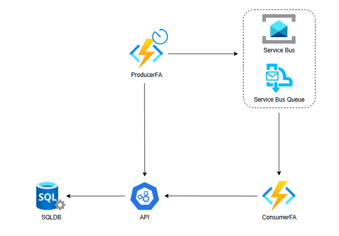
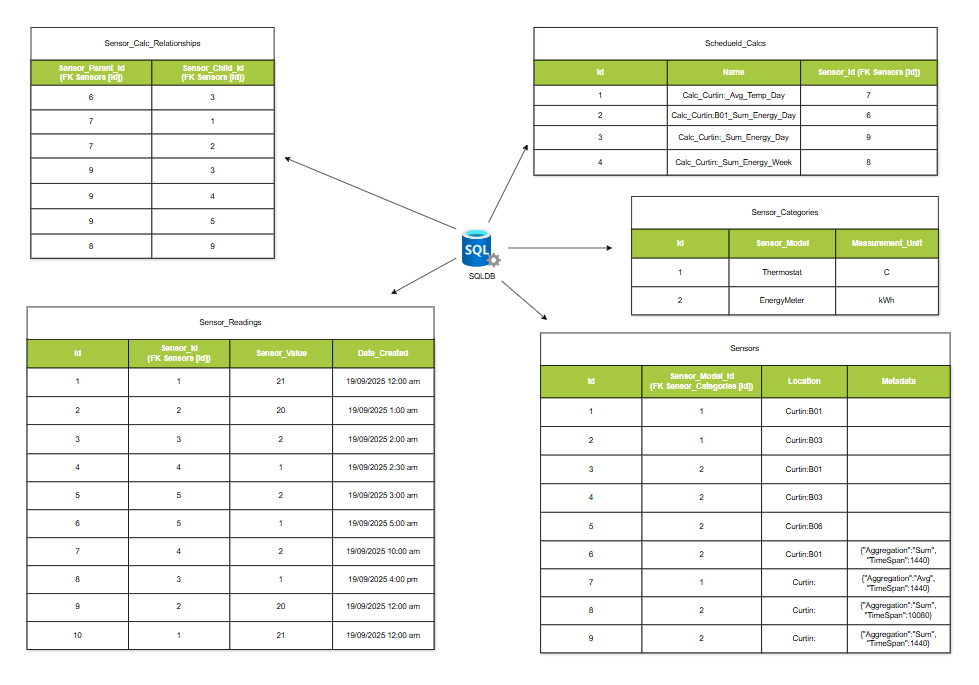

# Time Series POC

#### Problem Statement
---
We have a time series dataset that contains hundreds of millions of rows of data and its expanding by 100s of thousands of rows daily. The data is coming from multiple sources and is in different formats and is eventually displayed to a dashboard containing multiple visualizations and statistics for different sources. The computations are becomming extremely expensive as the dataset grows, how can this be optimized?

#### My Approach
---
Under the assumptions that the database has been designed in the best possible way, To optimize the computations on a large and growing time series dataset, I took the following system design approach:
- Insert into the table an aggregate sensor that describes the Location ( eg., Room05, Building01, Curtin, etc) and its associated aggregation and time interval (in minutes).
- Create a table (Scheduled_Calcs) to store aggregated calculations for different time intervals (e.g., daily, weekly) for different buildings/clients. 
- Create a second table (Sensor_Calc_Relationships) to map which sensors are involved in generating the aggregated calculations.
- Set up a scheduled Function App that runs at specific intervals (eg., daily at midnight), retrieves the scheduled calculations list, and adds to a Service Bus Queue. This is to make it scalable and fault tolerant.
- Setup another Function App that is triggered by messages in the Service Bus Queue. This Function App will:
  - Retrieve the message from the queue.
  - Fetch the relevant sensors from the Sensor_Calc_Relationships table.
  - Fetch the parent sensor details from the Sensors table to get the aggregation type and time interval.
  - Retrieve the time series data for the specified child sensors from the Sensor_Readings table over the time interval specified by the parent sensor.
  - Perform the necessary aggregate calculations on the data from these sensors over the specified time interval.
  - Store the results into the Sensor_Readings table with the parent sensor ID and the calculated value.
- Create an API to act as a front door to the database, to which both the producer and consumer will use to interact with the database. This will help to abstract the database layer from the producer and consumer and also help to implement security and rate limiting if required.

#### Database Schema
---
All table scripts can be located [here](./SQLScripts)
The tables and sample data used in this design are as follows:
- **Sensor_Categories**: This table stores information on the sensors model and its unit of measurement along with an identifier.	
	- | Id | Sensor_Model | Measurement_Unit 
		|----|--------------|------------------|
		| 1  | Thermostat   | C                |
		| 2  | EnergyMeter  | kWh              |

- **Sensors**: This table stores information about each sensor, including its type (FK to Sensor_Categories), its location and a Json object to store its optional metadata (eg., Aggregation, Timespan). The location is string that can be seperated on ':' to location the place (eg., Curtin, UWA, etc), the building (eg., B01, B02, etc) and extended further where required. In a production scenario, the location would be its own table and Sensors would contain an FK to the ID.
	- | Id | Sensor_Model_Id (FK Sensor_Categories [Id]) | Location   | Metadata                              
		|----|---------------------------------------------|------------|---------------------------------------|
		| 1  | 1                                           | Curtin:B01 |                                       |
		| 2  | 1                                           | Curtin:B03 |                                       |
		| 3  | 2                                           | Curtin:B01 |                                       |
		| 4  | 2                                           | Curtin:B03 |                                       |
		| 5  | 2                                           | Curtin:B06 |                                       |
		| 6  | 2                                           | Curtin:B01 | {"Aggregation":"Sum", "TimeSpan":1440}|
		| 7  | 1                                           | Curtin:    | {"Aggregation":"Avg", "TimeSpan":1440}|
		| 8  | 2                                           | Curtin:    | {"Aggregation":"Sum", "TimeSpan":10080}|
		| 9  | 2                                           | Curtin:    | {"Aggregation":"Sum", "TimeSpan":1440}|

- **Sensor_Readings**: This is the table from the problem statement and is responsible for storing all time series data. It is composed of an Id, Sensor_Id (FK to Sensors), Sensor_Value, and Date_Created. Note: The sample data here doesn't show any aggregate calculation entries.
	- | Id | Sensor_Id (FK Sensors [Id]) | Sensor_Value | Date_Created        
		|----|------------------------------|--------------|---------------------|
		| 1  | 1                            | 21           | 19/09/2025 12:00 am |
		| 2  | 2                            | 20           | 19/09/2025 1:00 am  |
		| 3  | 3                            | 2            | 19/09/2025 2:00 am  |
		| 4  | 4                            | 1            | 19/09/2025 2:30 am  |
		| 5  | 5                            | 2            | 19/09/2025 3:00 am  |
		| 6  | 5                            | 1            | 19/09/2025 5:00 am  |
		| 7  | 4                            | 2            | 19/09/2025 10:00 am |
		| 8  | 3                            | 1            | 19/09/2025 4:00 pm  |
		| 9  | 2                            | 20           | 19/09/2025 12:00 am |
		| 10 | 1                            | 21           | 19/09/2025 12:00 am |

- **Scheduled_Calcs**: This table represents scheduled jobs that occur to solve the problem statement, it stores the name of the job and the sensor_id (FK to Sensors) for the aggregate function.
	- | Id | Name | Sensor_Id (FK Sensors [Id]) 
		|----|--------------------------------|----------------------------|
		| 1  | Calc_Curtin: Avg_Temp_Day      | 7                          |
		| 2  | Calc_Curtin:B01_Sum_Energy_Day | 6                          |
		| 3  | Calc_Curtin: Sum_Energy_Day    | 9                          |
		| 4  | Calc_Curtin: Sum_Energy_Week   | 8                          |

- **Sensor_Calc_Relationships**: This table describes all the child sensors that are required to create the aggregate sensor. It is composed of a Sensor_Parent_Id (FK to Sensors) and Sensor_Child_Id (FK to Sensors).
	- | Parent_Sensor_Id (FK Sensor [Id])| Child_Sensor_Id (FK Sensor [Id]) 
		|--------------------------------|--------------------------------|
		| 6                              | 3                              |
		| 7                              | 1                              |
		| 7                              | 3                              |
		| 9                              | 3                              |
		| 9                              | 4                              |
		| 9                              | 5                              |
		| 8                              | 9                              |
		
Below is a DB Design:
